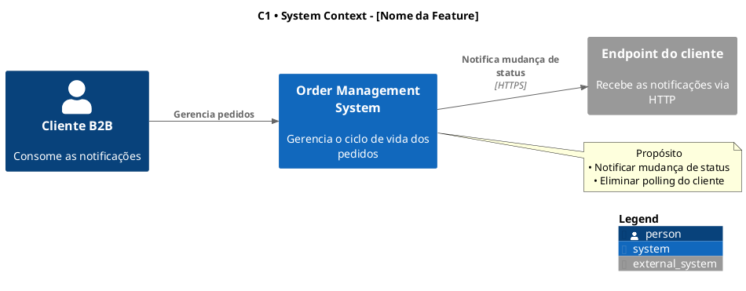
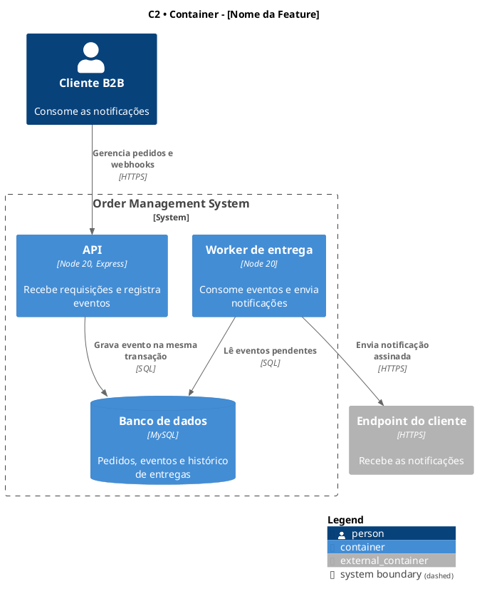
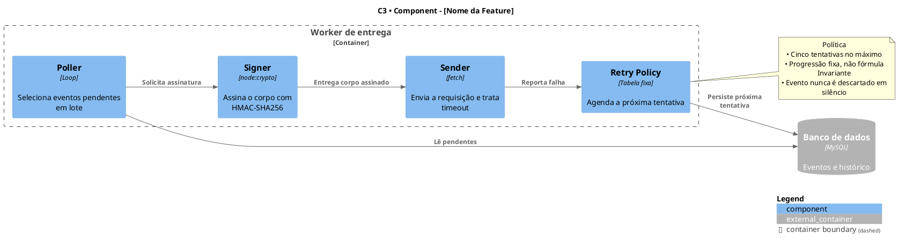
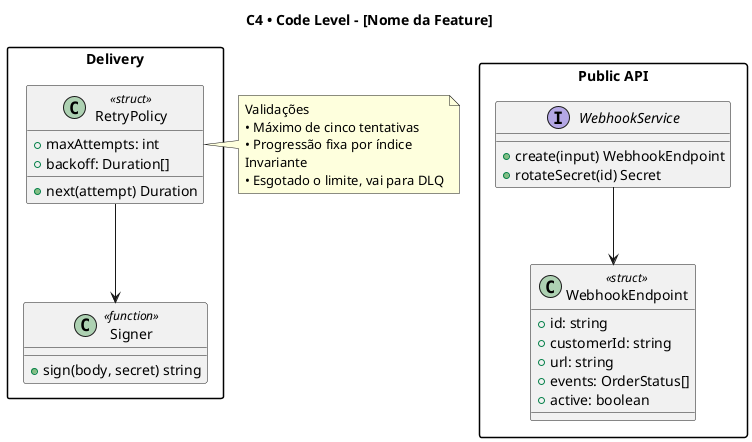

# Sintaxe C4-PlantUML: elementos, ordem de parâmetros e templates

Leia antes de escrever qualquer diagrama. As regras abaixo existem porque cada uma já produziu
um diagrama errado ou um artefato visível na imagem renderizada.

## Regras que valem para todos os níveis

**Charset é obrigatório e é a segunda linha.** Sem isso, acento não renderiza em nenhum idioma.

```plantuml
@startuml [feature]-c1
!pragma charset UTF-8
!include <C4/C4_Context>
```

**Título padronizado:** `title C[N] • [Nome do Nível] - [Nome da Feature]`

**Notas curtas.** Bullet com `•`, no máximo 3 a 5 por nota, cada linha com no máximo 10 a 12
palavras. Várias notas pequenas e focadas funcionam melhor que uma nota gigante. A nota
explica **por que** e o que não é óbvio, não repete o que já se lê na estrutura do diagrama.

**Nunca cite número de seção do documento de origem** dentro de rótulo ou nota.

**Sem emoji.**

## Ordem de parâmetros: a armadilha principal

A ordem **muda entre tipos de elemento**. Errar aqui empurra a descrição para a posição de
sprite e produz artefatos `<$` na imagem.

```plantuml
System_Ext($alias, $label, $descr="", $sprite="", $tags="", $link="", $type="")
Container($alias, $label, $techn="", $descr="", $sprite="", $tags="", $link="")
Component($alias, $label, $techn="", $descr="", $sprite="", $tags="", $link="")
```

Em `System_Ext`, a descrição vem **logo depois** do label. Em `Container` e `Component`, a
tecnologia vem antes da descrição.

```plantuml
%% ERRADO: "Redis 6.2+" cai em $descr e "Armazenamento..." cai em $sprite
System_Ext(redis, "Redis", "Redis 6.2+", "Armazenamento de estado compartilhado")

%% CERTO
System_Ext(redis, "Redis", "Armazenamento de estado compartilhado para rate limiting")

%% CERTO: em Container, a tecnologia tem posição própria
Container(app, "Serviço de Pagamentos", "Java 17", "Processa transações financeiras")
Container_Ext(redis, "Redis", "Redis 6.2+", "Armazenamento de estado compartilhado")
```

## Acentuação

Ortografia correta em todo texto, quando o idioma do documento a exige.

```plantuml
%% CERTO
Container(app, "Serviço de Pagamentos", "Java 17", "Processa transações financeiras")
Component(api, "API Pública", "Go interface", "Expõe operações REST")
note right
  Funcionalidades
  • Autenticação via JWT
  • Validação de cartão
end note

%% ERRADO
Container(app, "Servico de Pagamentos", "Java 17", "Processa transacoes financeiras")
Component(api, "API Publica", "Go interface", "Expoe operacoes REST")
```

Termos técnicos permanecem em inglês: Service, Collector, Tracer, Logger, Span, Container,
Database, API, REST, GraphQL, Redis, Kafka, Prometheus, OpenTelemetry, Docker, Kubernetes.

---

## C1 — System Context

**Público:** stakeholders e product managers.
**Foco:** contexto de negócio e fronteira do sistema.



**Permitido:** `Person()`, `System()`, `System_Ext()`, `System_Boundary()`, `Rel()`.
**Proibido:** tecnologia, componente interno, algoritmo, detalhe de implementação.
**Layout:** `LAYOUT_LEFT_RIGHT()` costuma ler melhor.
**Biblioteca embarcada não é `System()` separado.**

---

## C2 — Container

**Público:** arquitetos e tech leads.
**Foco:** stack de tecnologia e unidades de implantação.



**Permitido:** `Person()`, `Container()`, `ContainerDb()`, `Container_Ext()`,
`ContainerDb_Ext()`, `System_Boundary()`, `Rel()`.
**Obrigatório:** linguagem, framework e versão, quando o documento os informa.
**Proibido:** componente interno, algoritmo, detalhe de implementação.
**Layout:** `LAYOUT_TOP_DOWN()`.
**Biblioteca embarcada não é `Container()` separado.**

---

## C3 — Component

**Público:** tech leads e desenvolvedores sênior.
**Foco:** estrutura interna e responsabilidade de cada componente.



**Permitido:** `Component()`, `Container_Boundary()`, `Container_Ext()`, `ContainerDb_Ext()`,
`Rel()`.
**Foco no que faz, não em como faz.** Pseudocódigo e estrutura de dados interna ficam no C4.
**Layout:** `LAYOUT_LEFT_RIGHT()` ou `LAYOUT_TOP_DOWN()`, conforme a complexidade.

---

## C4 — Code

**Público:** desenvolvedores.
**Foco:** detalhe de implementação.

**Muda o formato:** C4 usa **diagrama de classes padrão**, não `C4_Component`.



**Sem `!include <C4/C4_Component>`.**
**Sem `SHOW_LEGEND()`** — não é compatível com diagrama de classes e é a causa mais comum de
erro de renderização no C4.
**Use `package`** para organizar logicamente: Public API, Core, Storage, Observability.
**Notas focam em validação, atomicidade e invariante**, nunca em pseudocódigo completo.
Máximo de 4 a 5 bullets por nota.
**Marque inferências:** `Inferência documentada: interface Strategy`.

---

## Estrutura do arquivo de análise

`<feature>-c4.md`, **sem nenhum código PlantUML dentro**.

```markdown
# Diagramas C4 - [Nome da Feature]

## Arquivos gerados

**Criados**
- `[feature]-c1.puml` — System Context
- `[feature]-c2.puml` — Container

**Ignorados**
- C3 Component: [razão, dizendo qual informação falta no documento]
- C4 Code: [razão]

Para renderizar, use qualquer ferramenta compatível com PlantUML.

## Análise

### Elementos explícitos do documento
- [elemento e onde aparece]

### Inferências feitas
- [o que foi inferido, o que sustenta a inferência e por quê]

### Exclusões confirmadas
- [item marcado como fora de escopo, que não aparece em nenhum diagrama]

### Natureza dos componentes
- [biblioteca embarcada ou sistema independente, com a justificativa]

## Descrição dos diagramas

### C1 - System Context
- **Público:** stakeholders, product managers
- **Elementos principais:** [lista breve]
- **Valor de negócio:** [uma ou duas frases]

### C2 - Container
- **Público:** arquitetos, tech leads
- **Containers principais:** [lista com tecnologia]
- **Contexto de implantação:** [uma ou duas frases]
```

## Erros de sintaxe mais comuns na renderização

| Erro | Causa | Correção |
| --- | --- | --- |
| Artefato `<$` na imagem | Ordem de parâmetros trocada | Confira `System_Ext` contra `Container` |
| Acento não renderiza | Falta `!pragma charset UTF-8` | Segunda linha do arquivo |
| Falha ao renderizar C4 | `SHOW_LEGEND()` em diagrama de classes | Remova do C4 |
| Parêntese não fechado | Rótulo com parêntese sem aspas | Coloque o rótulo entre aspas |
| Include não encontrado | Caminho antigo de include | Use `!include <C4/C4_Context>` |
